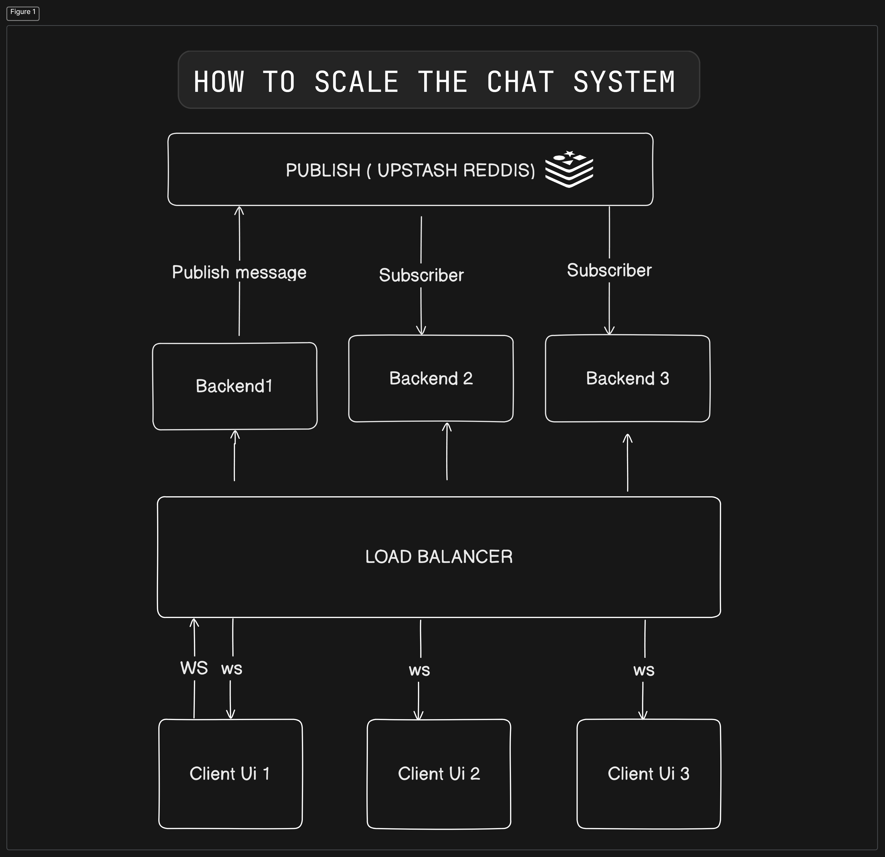
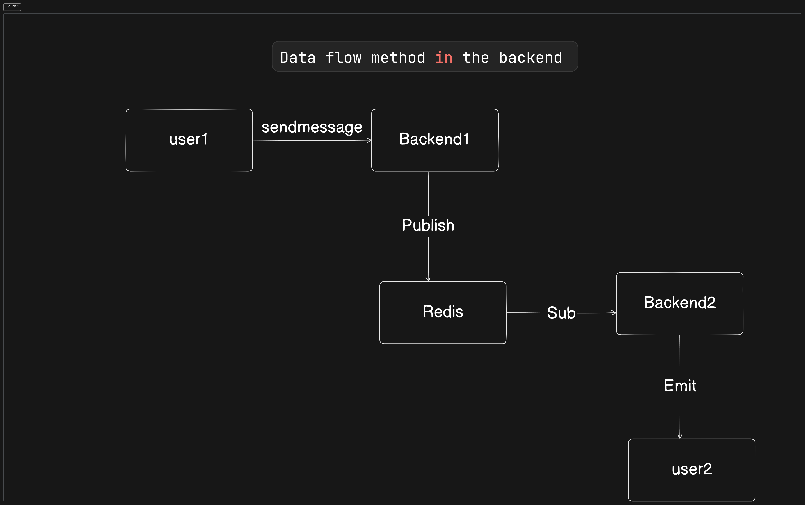

## Build and Deploy a Chat Application That Scales Horizontally with WebSockets and Upstash Redis
### Ui repo link -> https://github.com/RitulBhatnagar/scalable-chat-app-ui/tree/master
## What I have use?
1. Fastify - Backend
1. Websockets - Realtime 
1. Next.js - Frontend
1. Tailwind & Shadcn UI - Styling
1. Redis - Pub/Sub
1. Docker/docker-compose - Containerization
1. GitHub actions - CI/CD
1. DigitalOcean - Host the backend
1. Vercel - Host the frontend

## System architecture

## Data flow


## Debugging
### Websockets
1. We you are using `wss://` and not `ws://` in production
2. Use debug mode in Caddy server
```
{
    debug
}
```

### Docker
1. List our running docker containers
```bash
docker ps
```
1. Stop a running container
```bash
docker stop <container id>
```

1. Remove a container
```bash
docker rm <container id>
```

1. List out networks
```bash
docker network ls
```

1. Remove a network
```bash
docker network rm <network id>
```
